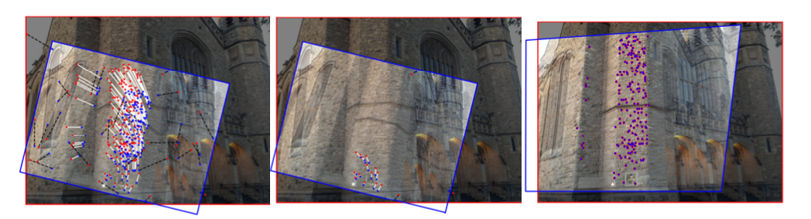

# HSolo

HSolo is a library for estimating similarity, affine, and projective homographies from matches produced by image feature detectors such as SURF and SIFT. HSolo will work for any image feature detector that produces an estimate of scale and rotation at each detected point.



HSolo is unique because it can estimate a full 9-DOF homography bootstrapping from only a single correspondence. That makes it faster than most other estimators and it can also find solutions when the ratio of true matches in the set is extremely low. 

HSolo is written in C++ with Python and Matlab wrappers and is meant to be used as an alternative to OpenCV's `findHomography` and Matlab's `EstimateGeometricTransform2D`. 

For more information, please refer to the [arXiv paper](https://arxiv.org/pdf/2009.05004.pdf). SAND2020-9405

## Installation

### Requirements

* General:  CMake 3.8+, Eigen 3.3+, OpenCV 4.4+, Pybind11 2.5+
* Python Wrapper:  Python 3.7+
* Matlab Wrapper:  Matlab 2018a+
* C++ Compliers -- must support C++17
    * For Windows, we successfuly built using [Microsoft Build Tools for VS 2019](https://visualstudio.microsoft.com/downloads/#build-tools-for-visual-studio-2019 ).  Make sure all commands are run from a `Native Tools Command Prompt`.

#### Pybind11 Dependency

Pybind11 2.5+ should be added directly to the project directory as follows:

* Clone this repo and navigate into its root directory.
* Create `lib` directory and navigate into it.
* Run `git clone https://github.com/pybind/pybind11.git`

### C++ Static Library and Example Executable

#### Unix and MacOS

* Create and navigate to `build` directory under `HSolo`.
* Run `cmake -DBUILD_STATIC_LIBRARY=ON -DBUILD_EXAMPLE_EXECUTABLE=ON ..`
* Run `make`

#### Windows

* Create and navigate to `build` directory under `HSolo`.
* Run `cmake -G "Visual Studio 16 2019" -A x64 -DBUILD_STATIC_LIBRARY=ON -DBUILD_EXAMPLE_EXECUTABLE=ON -DEIGEN3_INCLUDE_DIR="<path to eigen directory>" -DOpenCV_DIR="<path to opencv directory>\build" ..`
* Run `cmake --build <path to HSolo>\build --config Release --target ALL_BUILD`

### Python Wrapper

#### Unix and MacOS
* In the `HSolo` directory, run `pip install .`

#### Windows

* Create and navigate to `build` directory under `HSolo`
* Run `cmake -G "Visual Studio 16 2019" -A x64 -DBUILD_PYTHON_WRAPPER=ON -DEIGEN3_INCLUDE_DIR="<path to eigen directory>" -DOpenCV_DIR="<path to opencv directory>\build" ..`
* Run `cmake --build <path to HSolo>\build --config Release --target ALL_BUILD`
* Run `SET HSOLO_INSTALL_USE_PREBUILT=1`
* Run `pip install .`

### Matlab Wrapper

#### Unix and MacOS

* Create and navigate to `build` directory under `HSolo`.
* Run `cmake -DBUILD_MATLAB_MEX=ON ..`
* Run `make`

#### Windows

* Create and navigate to `build` directory under `HSolo`
* Run `cmake -G "Visual Studio 16 2019" -A x64 -BUILD_MATLAB_MEX=ON -DEIGEN3_INCLUDE_DIR="<path to eigen directory>" -DOpenCV_DIR="<path to opencv directory>\build" ..`
* Run `cmake --build <path to HSolo>\build --config Release --target ALL_BUILD`

## Testing HSolo

* Python: Use the `pyhsolo_example` Jupyter Notebook in the root directory.
* C++:  Run the `hsolo_example` executable created in the `bin` directory.  Note:  You need to be in the `bin` directory when running the example.
* Matlab:  Run the `hsolo_example.m` script in the `matlab` directory.

## Supported Transform Types

| Transform      | Description |  Function | Min Number Correspondences
| ----------- | ----------- | ----------- | :----:  |
| Similarity | Translation, Scale, Rotation   | findSimilarity | 2 |
| Affine | Translation, Scale, Rotation, Skew   | findAffine | 3 |
| Projective | Out of plane projection  | findHomography | 4 |
| Translation | Move  | findTranslation | 1 |

`HSolo` does not directly solve for Fundamental or Essential Matricies.  The `HSolo` Projective solver can be used as a pre-filter in inlier-sparse cases.  The inliers produced by `HSolo` can then be fed into existing solvers such as OpenCV `findFundamentalMatrix`. 

## API

### Parameters:

* **Confidence**:  (0, 1.0]. Default = 0.95.  Likelihood that a correct solution will be found.  This determines the number of iterations run based on a dynamically updating estimate of the inlier rate.  The higher the confidence, the longer runtime.  Note: to better match other Matlab geometry solvers, this is given as (0, 100] in the Matlab wrapper
* **Reprojection Error Threshold**:  > 0, Default = 2.0.  The maximum reprojection error (in pixels) for a correspondence to be considered an inlier.  This parameter is denoted `MaxDistance` in the Matlab wrapper.
* **Filtered Inlier Rate**:  (0, 1.0]. Default = 0.7.  The estimated inlier rate of the correspondnce set after being filtered by the initial homography estimate.  This determines the number of inner RANSAC iterations.  Lower estimates will increase the likelihood of a correct result, but increase the run time.
* **Max Iterations**:  > 0.  Default=1000.  The maximum number of iterations allowed to run regardless of other parameter settings.
* **Run Inner RANSAC Thresh**:  > 0. Default = 25.  The highest median reprojection error of the filtered inlier set in order for the inner ransac estimatino to run.  Higher thresholds will increase the likelihood of a correct result, but increase the run time.  The default of 25 works well generally, but this can be tuned for specific datasets.
* **Search Top N Filtered**:  (>= 4 homography, >=3 for affine, >=2 for similarity).  Default = 20.  The number of the top N filtered matches to be searched during the inner RANSAC step. 

### Input Data

* **x,y Pixel Location**
* **Features Scale**
* **Orientation in Degrees**


### C++ API: 
```c++
struct HSoloCorrespondence
{
    double pt1_x;     // x-coordinate for 1st correspondence
    double pt1_y;     // y-coordinate for 1st correspondence
    double pt2_x;     // x-coordinate for 2nd correspondence
    double pt2_y;     // y-coordinate for 2nd correspondence
    double pt1_ori;   // orientation for 1st correspondence
    double pt1_scale; // scale for 1st correspondence
    double pt2_ori;   // orientation for 2nd correspondence
    double pt2_scale; // scale for 2nd correspondence
};
```

``` c++
std::vector<HSoloCorrespondence> corrs;
// Populate correspondences 

// Define parameter configuration
HSoloConfiguration config;
config.setConfidence(conf);
config.setErrorThreshold(thresh);
config.setFilteredInlierRate(fir);
config.setMaxIterations(miters);
config.setRunInnerRANSACThresh(rirth);
config.setSearchTopNfiltered(searchTopN);

// Input: hsolo_matches is std::vector<HSoloCorrespondence>
// Output: HSoloResult
HSolo hsolo;
HSoloResult hsoloResult = hsolo.findHomography(hsolo_matches, config);
```
### Python API: 
``` python
# Input:  x1y1, x2y2 are [Nx2] numpy arrays of the locations of the point corresondences
#         scales1, scales2 are [Nx1] numpy arrays of the scales of the point corresondences
#         oris1, oris2 are [Nx1] numpy arrays of the orientation (in degrees) of the point corresondences
# Output: H is a tuple containing (homography matrix, inliers)
#         If get_stats=True then H contains (homography matrix, inliers, result_stats)
H = find_homography(x1y1, x2y2, scales1, scales2, oris1, oris2)
```
### Matlab API:
``` matlab
% Input: matchedPoints are features detected and matched using matlab. detectXXXXFeatures and matchFeatures
% Output: Projective2D object
estimateGeometricTransform2D(...
        matchedPoints1, ...
        matchedPoints2, ...
        transformType...
    );
```

## Contributing

Thank you for your interest in contributing to the success of HSolo. Please see our [Contributing Guide](CONTRIBUTING.md) to learn more. 

## Copyright

Copyright 2021 National Technology & Engineering Solutions of Sandia, LLC (NTESS). 
Under the terms of Contract DE-NA0003525 with NTESS, the U.S. Government retains certain rights in this software.

Licensed under the Apache License, Version 2.0
